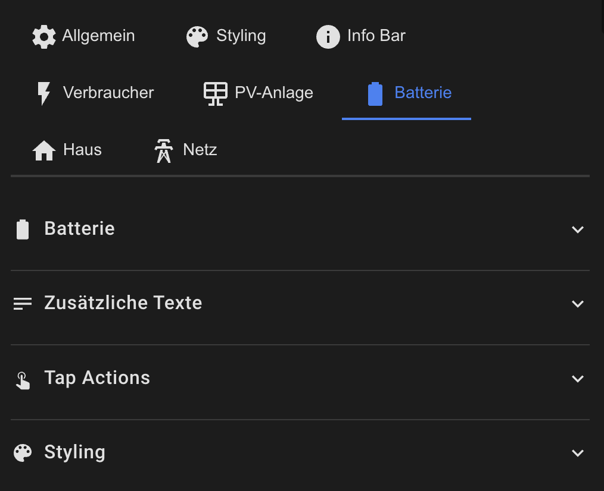

# Battery Configuration

The battery card shows the charge level and charge/discharge power.



## Basic Configuration

```yaml
batterie:
  show: true
  icon: ''                    # Empty = automatic (based on SoC)
  animation: true
  animation_style: electric-arc
```

## Automatic Icon Selection

- SoC > 90% → `mdi:battery`
- SoC > 70% → `mdi:battery-80`
- SoC > 50% → `mdi:battery-60`
- SoC > 30% → `mdi:battery-40`
- SoC > 10% → `mdi:battery-20`
- SoC ≤ 10% → `mdi:battery-alert`

When charging, `-charging` is appended (e.g., `mdi:battery-60-charging`)

## Color Coding

The battery is automatically color-coded:
- **Green** (SoC > 60%)
- **Yellow** (SoC 30-60%)
- **Red** (SoC < 30%)

## Additional Texts

```yaml
batterie:
  secondary_entity: sensor.battery_temperature
  secondary_text: "Temperature"
  
  tertiary_entity: sensor.battery_cycles
  tertiary_text: "Cycles"
```

## Styling

```yaml
batterie:
  style:
    background_color: 'rgba(21, 20, 27, 1)'
    border_color: 'rgba(255, 255, 255, 0.1)'
    primary_color: '#4CAF50'
    secondary_color: '#8BC34A'
    icon_color: ''              # Empty = automatic color
```

## Tap Actions

```yaml
batterie:
  tap_action:
    action: more-info
  double_tap_action:
    action: navigate
    navigation_path: /lovelace/battery-details
  hold_action:
    action: call-service
    service: script.battery_calibration
```

[Back to Main README](../README.md)
