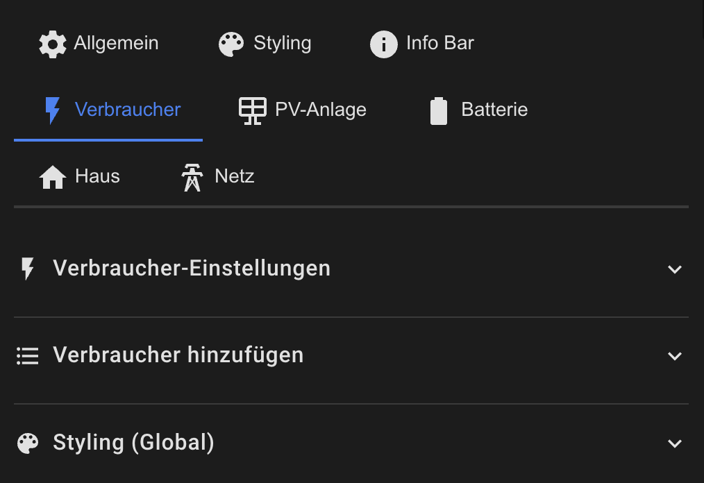

# Consumers Configuration

The consumers section shows individual power consumers with their current power consumption.



## Basic Configuration

```yaml
consumers:
  show: true
  position: bottom                  # Currently only 'bottom'
  sort_mode: highest_first          # highest_first | lowest_first | none | alpha_asc | alpha_desc
  threshold: 10                     # Only show consumers > X Watts
```

## Sort Modes

- `highest_first` – Highest consumption first (default)
- `lowest_first` – Lowest consumption first
- `none` – No sorting (order as configured)
- `alpha_asc` – Alphabetically A-Z
- `alpha_desc` – Alphabetically Z-A

## Adding Consumers

### Basic Consumer

```yaml
consumers:
  items:
    - entity: sensor.dishwasher_power
      icon: mdi:dishwasher
      label: 'Dishwasher'
      threshold: 5                  # Individual threshold (overrides global)
      auto_color: true              # Automatic color for on/off
```

### Consumer with Additional Text

```yaml
consumers:
  items:
    - entity: sensor.washing_machine_power
      icon: mdi:washing-machine
      label: 'Washing Machine'
      
      # Primary line (power value)
      show_primary: true
      primary_entity: ''            # Empty = use entity value
      primary_text: ''              # Optional prefix
      
      # Secondary line (e.g. daily consumption)
      show_secondary: true
      secondary_entity: sensor.washing_machine_energy_daily
      secondary_text: 'Today'
```

### Consumer with Switch

```yaml
consumers:
  items:
    - entity: sensor.heater_power
      icon: mdi:radiator
      label: 'Heater'
      switch_entity: switch.heater
      
      tap_action:
        action: more-info           # Tap on card = more-info
                                    # Tap on icon = toggle switch
```

### Consumer with Custom Actions

```yaml
consumers:
  items:
    - entity: sensor.ev_charger_power
      icon: mdi:ev-station
      label: 'EV Charger'
      
      tap_action:
        action: navigate
        navigation_path: /lovelace/ev-charging
      
      double_tap_action:
        action: call-service
        service: notify.mobile_app
        service_data:
          message: 'EV Charger tapped'
      
      hold_action:
        action: more-info
```

## Auto Color

When `auto_color: true`:
- **Consumer active** (power > threshold): Green color
- **Consumer inactive** (power ≤ threshold): Gray/dimmed color

```yaml
consumers:
  items:
    - entity: sensor.coffee_machine_power
      icon: mdi:coffee
      label: 'Coffee Machine'
      auto_color: true              # ✅ Green when active
      threshold: 5
```

To disable auto-color and use custom colors:
```yaml
consumers:
  items:
    - entity: sensor.aquarium_power
      icon: mdi:fishbowl
      label: 'Aquarium'
      auto_color: false
      style:
        icon_color: '#00BCD4'       # Always cyan
```

## Global Styling

Styles that apply to all consumers:

```yaml
consumers:
  style:
    gap: '6px'                              # Spacing between consumers
    
    # Container styling
    item_background_color: 'rgba(21, 20, 27, 1)'
    item_border_color: 'rgba(255, 255, 255, 0.1)'
    item_border_radius: '12px'
    item_padding: '8px'
    item_margin: '0'
    item_box_shadow: '0 2px 4px rgba(0,0,0,0.1)'
    
    # Icon styling
    icon_size: '1.5em'
    icon_opacity: '1'
    
    # Primary text (power value)
    primary_size: '1em'
    primary_font_weight: 'bold'
    primary_opacity: '1'
    primary_color: 'white'
    
    # Secondary text (label)
    secondary_size: '0.8em'
    secondary_font_weight: 'normal'
    secondary_opacity: '0.7'
    secondary_color: 'white'
```

## Individual Styling

Each consumer can override global styles:


```yaml
consumers:
  items:
    - entity: sensor.heat_pump_power
      icon: mdi:heat-pump
      label: 'Heat Pump'
      
      style:
        # Custom colors
        icon_size: '2em'
        icon_color: '#FF5722'
        icon_opacity: '1'
        
        primary_color: '#FF5722'
        primary_size: '1.2em'
        primary_font_weight: 'bold'
        
        secondary_color: '#FF7043'
        secondary_size: '0.9em'
        
        # Custom container
        background_color: 'rgba(255, 87, 34, 0.1)'
        border_color: 'rgba(255, 87, 34, 0.3)'
        border_radius: '16px'
        padding: '12px'
```

## Visibility Control

### Threshold

Only consumers above the threshold are displayed:

```yaml
consumers:
  threshold: 10                     # Global threshold

  items:
    - entity: sensor.tv_power
      label: 'TV'
      threshold: 5                  # Individual threshold
    
    - entity: sensor.router_power
      label: 'Router'
      # Uses global threshold (10W)
```

### Manual Hide/Show

Consumers below threshold are automatically hidden. To manually control visibility:

```yaml
consumers:
  items:
    - entity: sensor.standby_power
      label: 'Standby'
      threshold: 0                  # Always show, even at 0W
```

## Complete Example

```yaml
consumers:
  show: true
  position: bottom
  sort_mode: highest_first
  threshold: 10
  
  style:
    gap: '8px'
    item_background_color: 'rgba(21, 20, 27, 1)'
    item_border_radius: '12px'
    icon_size: '1.5em'
  
  items:
    # EV Charger - Custom styled
    - entity: sensor.ev_charger_power
      icon: mdi:ev-station
      label: 'EV Charger'
      switch_entity: switch.ev_charger
      threshold: 50
      auto_color: true
      
      secondary_entity: sensor.ev_charger_energy_session
      secondary_text: 'Session'
      
      style:
        icon_color: '#4CAF50'
        background_color: 'rgba(76, 175, 80, 0.1)'
        border_color: 'rgba(76, 175, 80, 0.3)'
      
      tap_action:
        action: navigate
        navigation_path: /lovelace/ev-charging
    
    # Heat Pump
    - entity: sensor.heat_pump_power
      icon: mdi:heat-pump
      label: 'Heat Pump'
      threshold: 20
      auto_color: true
      
      secondary_entity: sensor.heat_pump_cop
      secondary_text: 'COP'
    
    # Dishwasher
    - entity: sensor.dishwasher_power
      icon: mdi:dishwasher
      label: 'Dishwasher'
      threshold: 5
      auto_color: true
      
      tap_action:
        action: more-info
    
    # Pool Pump
    - entity: sensor.pool_pump_power
      icon: mdi:pump
      label: 'Pool Pump'
      switch_entity: switch.pool_pump
      threshold: 10
      auto_color: false
      
      style:
        icon_color: '#00BCD4'
```

## Consumer Sum in House Card

To display the total of all active consumers in the house card:

```yaml
haus:
  show_consumer_total: true

consumers:
  show: true
  threshold: 10
  items:
    - entity: sensor.consumer1_power
    - entity: sensor.consumer2_power
```

The house card will then show:
```
House: 3450 W
Consumers: 2100 W  ← Sum of all consumers > threshold
```

[Back to Main README](../README.md)
