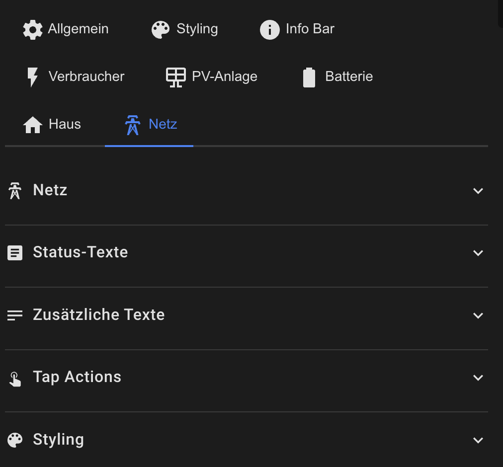

# Grid Configuration

The grid card shows feed-in, grid consumption, or neutral status.



## Basic Configuration

```yaml
netz:
  show: true
  icon: mdi:transmission-tower
  animation: true
  animation_style: rotating-dots
  threshold: 10                     # Threshold for neutral status (±X Watts)
```

## Status Texts

```yaml
netz:
  text_einspeisen: "Feed-in"        # For negative values
  text_neutral: "Neutral"           # For ±threshold
  text_bezug: "Grid Consumption"    # For positive values
```

## Status Logic

- `grid_power < -threshold` → Feed-in (green animation)
- `-threshold ≤ grid_power ≤ threshold` → Neutral (no animation)
- `grid_power > threshold` → Grid consumption (red animation)

**Example with threshold = 10:**
- Grid: -500 W → Feed-in (green)
- Grid: 5 W → Neutral (gray)
- Grid: 800 W → Grid consumption (red)

## Additional Texts

```yaml
netz:
  secondary_entity: sensor.grid_daily_export
  secondary_text: "Feed-in today"
  
  tertiary_entity: sensor.grid_daily_import
  tertiary_text: "Consumption today"
```

## Styling

```yaml
netz:
  style:
    background_color: 'rgba(21, 20, 27, 1)'
    border_color: 'rgba(255, 255, 255, 0.1)'
    primary_color: '#03A9F4'
    secondary_color: '#00BCD4'
    icon_color: '#03A9F4'
```

## Tap Actions

```yaml
netz:
  tap_action:
    action: more-info
  double_tap_action:
    action: navigate
    navigation_path: /lovelace/grid-overview
  hold_action:
    action: call-service
    service: script.grid_analysis
```

[Back to Main README](../README.md)
