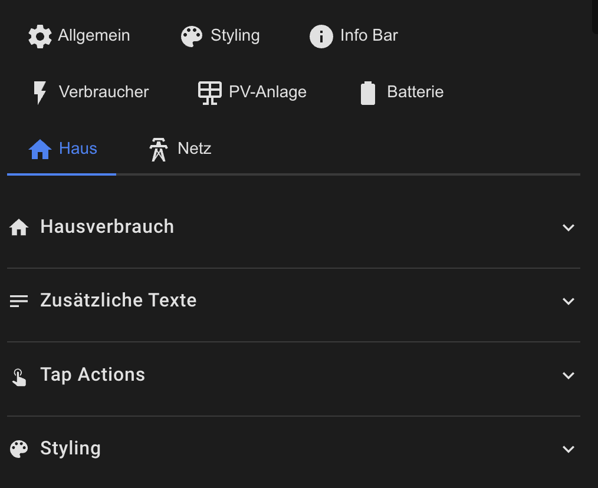

# House Consumption Configuration

The house card displays the current total consumption.



## Basic Configuration

```yaml
haus:
  show: true
  icon: mdi:home
  animation: true
  animation_style: particle-field
  show_consumer_total: false    # Show sum of all consumers
```

## Consumer Sum

If `show_consumer_total: true` and consumers are configured, the sum of all active consumers is displayed in the second line:

```
House: 3450 W
Consumers: 2100 W  ← Sum of all configured consumers
```

## Additional Texts

```yaml
haus:
  secondary_entity: sensor.house_daily_consumption
  secondary_text: "Today"
  
  tertiary_entity: sensor.house_monthly_consumption
  tertiary_text: "This Month"
```

## Styling

```yaml
haus:
  style:
    background_color: 'rgba(21, 20, 27, 1)'
    border_color: 'rgba(255, 255, 255, 0.1)'
    primary_color: '#FF9800'
    secondary_color: '#FFC107'
    icon_color: '#FF9800'
```

## Tap Actions

```yaml
haus:
  tap_action:
    action: more-info
  double_tap_action:
    action: navigate
    navigation_path: /lovelace/consumption
  hold_action:
    action: call-service
    service: script.consumption_analysis
```

## Consumer Toggle

When consumers are configured and visible, clicking the house card toggles the consumer visibility. This overrides the `tap_action` for single clicks.

[Back to Main README](../README.md)
