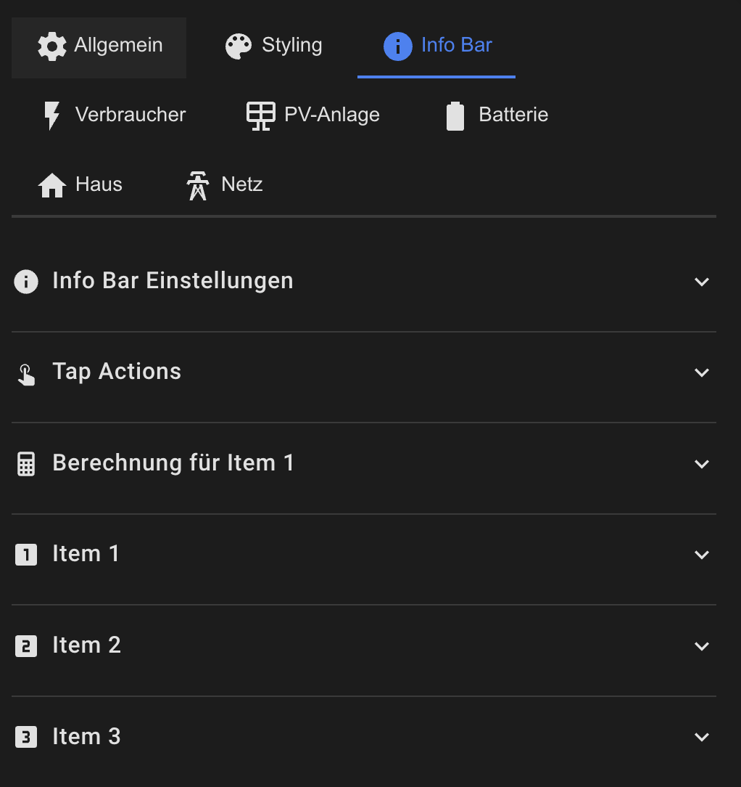

# Info Bar Configuration

The info bar displays up to 3 configurable values with automatic calculations.



## Basic Configuration

```yaml
info_bar:
  show: true
  position: top                    # top | bottom
  calculation_mode: autarky        # autarky | self_consumption
  calculate_battery_times: true   # Calculate battery runtime and charge time
```

## Calculation Modes

### Autarky (Autonomy)

**Formula:**
```
Autonomy = (House Consumption - Grid Consumption) / House Consumption × 100
```

**Meaning:**  
Indicates what percentage of house consumption is covered by own generation (PV + Battery).

**Example:**
- House Consumption: 3000 W
- Grid Consumption: 500 W
- Autonomy = ((3000 - 500) / 3000) × 100 = 83.3%

**Characteristics:**
- During feed-in (negative grid consumption) autonomy can be > 100%
- Limited to 100% in display

### Self Consumption

**Formula:**
```
Self-consumption = (PV Production - Grid Feed-in) / PV Production × 100
```

**Meaning:**  
Indicates what percentage of PV production is self-consumed (not fed in).

**Example:**
- PV Production: 5000 W
- Feed-in: 1000 W
- Self-consumption = ((5000 - 1000) / 5000) × 100 = 80%

## Configuring Items

### Item 1 – Autonomy/Self-consumption (automatic)

```yaml
info_bar:
  calculation_mode: autarky         # or self_consumption
  item1:
    entity: ''                      # Empty = automatically calculated
    icon: mdi:home-lightning-bolt
    label: 'Autonomy'               # or 'Self-consumption'
    unit: '%'
```

### Item 2 – Battery Runtime (automatic)

```yaml
info_bar:
  calculate_battery_times: true
  item2:
    entity: ''                      # Empty = automatically calculated
    icon: mdi:battery-clock
    label: 'Remaining Runtime'
    unit: ''                        # Unit is set automatically
```

**Formula:**
```
Runtime = (Battery SoC × Battery Capacity) / Discharge Power
```

**Display:**
- Over 1 hour: "X hrs Y min"
- Under 1 hour: "X minutes"
- No discharge: "Not available"

### Item 3 – Battery Charge Time (automatic)

```yaml
info_bar:
  calculate_battery_times: true
  item3:
    entity: ''                      # Empty = automatically calculated
    icon: mdi:battery-charging
    label: 'Charge Time'
    unit: ''
```

**Formula:**
```
Charge Time = ((100 - Battery SoC) × Battery Capacity) / Charge Power
```

**Display:**
- Over 1 hour: "X hrs Y min"
- Under 1 hour: "X minutes"
- No charging: "Not available"
- Fully charged: "Full"

### Using Custom Entities

```yaml
info_bar:
  item1:
    entity: sensor.solar_forecast_today
    icon: mdi:weather-sunny
    label: 'Forecast'
    unit: 'kWh'
  
  item2:
    entity: sensor.electricity_price_current
    icon: mdi:currency-eur
    label: 'Price'
    unit: 'ct/kWh'
  
  item3:
    entity: sensor.co2_savings_today
    icon: mdi:leaf
    label: 'CO₂ Saved'
    unit: 'kg'
```

## Individual Calculation per Item

You can configure different calculation types for each item:

```yaml
info_bar:
  item1_calc_type: autarky          # autarky | self_consumption | runtime | chargetime
  item2_calc_type: runtime
  item3_calc_type: chargetime
```

This allows mixing different calculations without using `calculation_mode`.

## Styling

```yaml
info_bar:
  style:
    background_color: 'rgba(21, 20, 27, 1)'
    border_color: 'rgba(255, 255, 255, 0.1)'
    border_radius: '12px'
    padding: '8px'
    gap: '16px'
    
    # Icon styling
    icon_size: '1.5em'
    icon_color: '#2196F3'
    
    # Label styling
    label_size: '0.8em'
    label_color: 'rgba(255, 255, 255, 0.7)'
    label_font_weight: 'normal'
    label_line_height: '1.2'
    
    # Value styling
    value_size: '1.2em'
    value_color: 'white'
    value_font_weight: 'bold'
    value_line_height: '1.2'
```

## Tap Actions

```yaml
info_bar:
  tap_action:
    action: navigate
    navigation_path: /lovelace/energy-details
  double_tap_action:
    action: more-info
  hold_action:
    action: call-service
    service: script.energy_report
```

## Complete Example

```yaml
info_bar:
  show: true
  position: top
  calculate_battery_times: true
  
  item1_calc_type: autarky
  item1:
    icon: mdi:home-lightning-bolt
    label: 'Autonomy'
    unit: '%'
  
  item2_calc_type: runtime
  item2:
    icon: mdi:battery-clock
    label: 'Runtime'
  
  item3:
    entity: sensor.solar_forecast_remaining
    icon: mdi:weather-sunny
    label: 'Forecast Today'
    unit: 'kWh'
  
  tap_action:
    action: navigate
    navigation_path: /lovelace/energy
  
  style:
    background_color: 'rgba(33, 150, 243, 0.1)'
    border_color: 'rgba(33, 150, 243, 0.3)'
    icon_color: '#2196F3'
```

[Back to Main README](../README.md)
