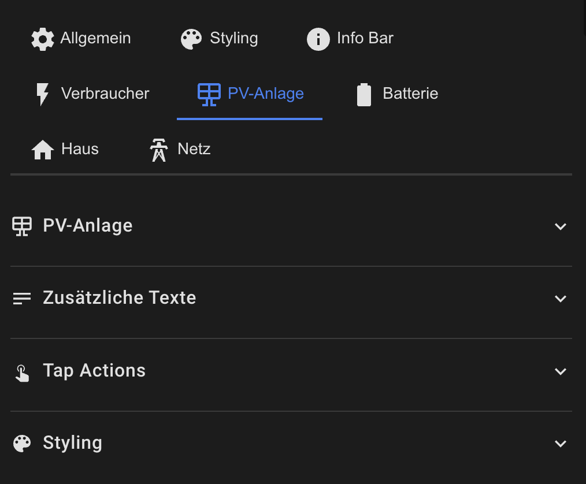

# PV System Configuration

The PV card displays the current solar production.



## Basic Configuration

```yaml
pv:
  show: true                          # Show card
  icon: mdi:white-balance-sunny       # Custom icon
  animation: true                     # Enable animation
  animation_style: rotating-dots      # rotating-dots | particle-field | electric-arc
  icon_rotation: true                 # Icon rotates with power
```

## Additional Texts

```yaml
pv:
  # Second line (e.g., daily yield)
  secondary_entity: sensor.pv_daily_yield
  secondary_text: "Today"             # Static text before value
  
  # Third line (e.g., total yield)
  tertiary_entity: sensor.pv_total_yield
  tertiary_text: "Total"
```

## Styling

```yaml
pv:
  style:
    background_color: 'rgba(21, 20, 27, 1)'
    border_color: 'rgba(255, 255, 255, 0.1)'
    primary_color: '#FFD700'        # Color for main value
    secondary_color: '#FFA500'      # Color for secondary text
    icon_color: '#FFD700'           # Icon color
```

## Tap Actions

```yaml
pv:
  tap_action:
    action: more-info
  double_tap_action:
    action: navigate
    navigation_path: /lovelace/energy
  hold_action:
    action: call-service
    service: script.pv_reset
```

**Available Actions:**
- `none` – No action
- `more-info` – Opens more-info dialog
- `navigate` – Navigation to a dashboard (requires `navigation_path`)
- `url` – Opens URL (requires `url_path`)
- `call-service` – Calls service (requires `service` and optionally `service_data`)

[Back to Main README](../README.md)
