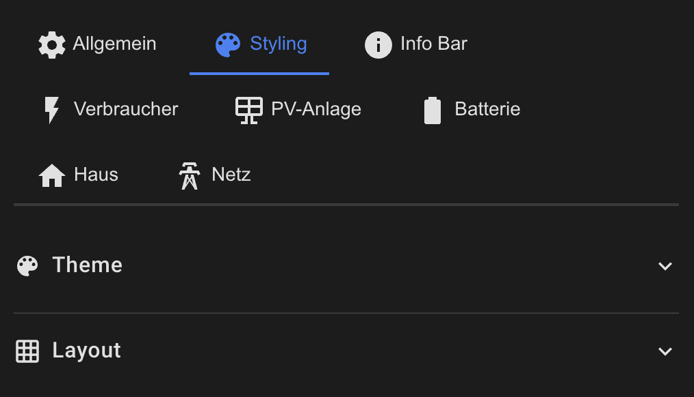

# Styling & Layout Configuration

Complete guide to customizing the visual appearance of the PV Monitor Card.



## Table of Contents

- [Themes](#themes)
- [Global Layout](#global-layout)
- [Header Styling](#header-styling)
- [Icon Styling](#icon-styling)
- [Text Styling](#text-styling)
- [Card Styling](#card-styling)
- [Info Bar Styling](#info-bar-styling)
- [Consumer Styling](#consumer-styling)
- [Animation Styles](#animation-styles)
- [Color Formats](#color-formats)

## Themes

Pre-built themes for quick setup:

```yaml
theme: modern-dark    # Default theme
```

**Available Themes:**
1. `modern-dark` – Dark background, modern color accents
2. `blue-energy` – Blue energy colors, cool aesthetic
3. `minimalist` – Reduced colors, clean lines
4. `solar-bright` – Bright, sunny yellow-orange colors
5. `nature-green` – Green, natural colors
6. `high-contrast` – High contrasts for accessibility

**Custom Theme Based on Preset:**
```yaml
theme: solar-bright

style:
  # Override specific theme values
  card_background_color: 'rgba(255, 248, 220, 1)'
  primary_color: '#FF8C00'
```

## Global Layout


```yaml
grid_gap: '6px'                     # Spacing between main cards (PV, Battery, House, Grid)

style:
  header_margin_bottom: '12px'      # Spacing from header to cards
  infobar_gap: '6px'               # Spacing between info bar items
  
  # Alignment
  title_align: center               # left | center | right
  subtitle_align: center
```

## Header Styling


```yaml
style:
  # Title
  title_color: 'white'
  title_size: '1.5em'
  title_font_weight: 'bold'
  title_line_height: '1.2'
  
  # Subtitle
  subtitle_color: 'rgba(255, 255, 255, 0.7)'
  subtitle_size: '1em'
  subtitle_font_weight: 'normal'
  subtitle_line_height: '1.2'
  title_subtitle_gap: '4px'         # Spacing between title and subtitle
  
  # Header Icon
  header_icon_size: '2em'
  header_icon_color: 'white'
  header_icon_margin: '8px'
  
  # Header Background (optional)
  header_background_enabled: false  # Enable background box
  header_background_color: 'rgba(21, 20, 27, 1)'
  header_border_color: 'rgba(255, 255, 255, 0.1)'
  header_border_radius: '12px'
  header_padding: '12px'
  header_box_shadow: '0 2px 4px rgba(0,0,0,0.1)'
  header_width: 'auto'              # auto | full
```

## Icon Styling

Global icon settings (applies to all cards unless overridden):

```yaml
style:
  icon_size: '2em'
  icon_opacity: '1'
  icon_margin: '6px'                # Spacing below icon
```

**Card-Specific Icon Color:**
```yaml
pv:
  style:
    icon_color: '#FFD700'           # Custom gold color for PV icon
```

## Text Styling


### Primary Text (Main Value)

```yaml
style:
  primary_color: 'white'
  primary_size: '1.2em'
  primary_font_opacity: '1'
  primary_font_weight: 'normal'     # normal | bold | 100-900
  primary_line_height: '1.2'
```

### Secondary Text

```yaml
style:
  secondary_color: 'white'
  secondary_size: '0.9em'
  secondary_font_opacity: '0.7'
  secondary_font_weight: 'normal'
  secondary_line_height: '1.2'
```

### Tertiary Text

```yaml
style:
  tertiary_color: 'white'
  tertiary_size: '0.9em'
  tertiary_font_opacity: '0.7'
  tertiary_font_weight: 'normal'
  tertiary_line_height: '1.2'
```

## Card Styling


### Global Card Styles

```yaml
style:
  card_background_color: 'rgba(21, 20, 27, 1)'
  card_border_color: 'rgba(255, 255, 255, 0.1)'
  card_border_radius: '16px'
  card_padding: '12px'
  card_boxshadow: '0 2px 8px rgba(0, 0, 0, 0.3)'
  card_text_color: 'white'
  card_cursor: 'pointer'            # pointer | default | help
```

### Card-Specific Styles

Each card (PV, Battery, House, Grid) can have individual styling:

```yaml
pv:
  style:
    background_color: 'rgba(255, 215, 0, 0.1)'
    border_color: 'rgba(255, 215, 0, 0.3)'
    primary_color: '#FFD700'
    secondary_color: '#FFA500'
    icon_color: '#FFD700'

batterie:
  style:
    background_color: 'rgba(76, 175, 80, 0.1)'
    border_color: 'rgba(76, 175, 80, 0.3)'
    primary_color: '#4CAF50'
    icon_color: ''                  # Empty = automatic based on SoC

haus:
  style:
    background_color: 'rgba(255, 152, 0, 0.1)'
    border_color: 'rgba(255, 152, 0, 0.3)'
    primary_color: '#FF9800'

netz:
  style:
    background_color: 'rgba(3, 169, 244, 0.1)'
    border_color: 'rgba(3, 169, 244, 0.3)'
    primary_color: '#03A9F4'
```

## Info Bar Styling

```yaml
info_bar:
  style:
    background_color: 'rgba(21, 20, 27, 1)'
    border_color: 'rgba(255, 255, 255, 0.1)'
    border_radius: '12px'
    padding: '8px'
    gap: '16px'                     # Spacing between items
    
    # Icon
    icon_size: '1.5em'
    icon_color: '#2196F3'
    
    # Label
    label_size: '0.8em'
    label_color: 'rgba(255, 255, 255, 0.7)'
    label_font_weight: 'normal'
    label_line_height: '1.2'
    
    # Value
    value_size: '1.2em'
    value_color: 'white'
    value_font_weight: 'bold'
    value_line_height: '1.2'
```

## Consumer Styling

### Global Consumer Styles

```yaml
consumers:
  style:
    gap: '6px'                              # Spacing between consumers
    
    # Container
    item_background_color: 'rgba(21, 20, 27, 1)'
    item_border_color: 'rgba(255, 255, 255, 0.1)'
    item_border_radius: '12px'
    item_padding: '8px'
    item_margin: '0'
    item_box_shadow: '0 2px 4px rgba(0,0,0,0.1)'
    
    # Icon
    icon_size: '1.5em'
    icon_opacity: '1'
    
    # Primary (power value)
    primary_size: '1em'
    primary_font_weight: 'bold'
    primary_opacity: '1'
    primary_color: 'white'
    
    # Secondary (label)
    secondary_size: '0.8em'
    secondary_font_weight: 'normal'
    secondary_opacity: '0.7'
    secondary_color: 'white'
```

### Individual Consumer Styles

```yaml
consumers:
  items:
    - entity: sensor.ev_charger_power
      label: 'EV Charger'
      
      style:
        icon_size: '2em'
        icon_color: '#4CAF50'
        primary_color: '#4CAF50'
        secondary_color: '#8BC34A'
        background_color: 'rgba(76, 175, 80, 0.1)'
        border_color: 'rgba(76, 175, 80, 0.3)'
        border_radius: '16px'
        padding: '12px'
```

## Animation Styles

Three different animation styles are available:

### 1. Rotating Dots (Default)

```yaml
pv:
  animation: true
  animation_style: rotating-dots
```

Circular dots rotating around the icon.

### 2. Particle Field

```yaml
batterie:
  animation: true
  animation_style: particle-field
```

Animated particles moving across the card.

### 3. Electric Arc

```yaml
netz:
  animation: true
  animation_style: electric-arc
```

Electric arc effect around the icon.

**Animation Colors:**
- Animations automatically use appropriate colors based on card state
- PV: Yellow-gold for production
- Battery: Green (charging), red (discharging)
- House: Orange for consumption
- Grid: Green (feed-in), red (consumption)

## Color Formats

All colors can be specified in multiple formats:

### RGBA (Recommended for transparency)
```yaml
background_color: 'rgba(21, 20, 27, 1)'       # Black with full opacity
border_color: 'rgba(255, 255, 255, 0.1)'      # White with 10% opacity
```

### RGB
```yaml
primary_color: 'rgb(255, 215, 0)'             # Gold
```

### Hex
```yaml
icon_color: '#FFD700'                         # Gold
secondary_color: '#FFA500'                    # Orange
```

### CSS Color Names
```yaml
text_color: 'white'
background: 'black'
border: 'gray'
```

## Complete Styling Example

```yaml
type: custom:pv-monitor-card
theme: modern-dark

# Override theme with custom styling
grid_gap: '8px'

style:
  # Header
  title_color: '#FFD700'
  title_size: '2em'
  title_font_weight: 'bold'
  subtitle_color: 'rgba(255, 215, 0, 0.7)'
  header_margin_bottom: '16px'
  
  # Global card styling
  card_background_color: 'rgba(30, 30, 30, 1)'
  card_border_color: 'rgba(255, 215, 0, 0.3)'
  card_border_radius: '20px'
  card_padding: '16px'
  card_boxshadow: '0 4px 12px rgba(0, 0, 0, 0.5)'
  
  # Icons
  icon_size: '2.5em'
  icon_opacity: '1'
  
  # Text
  primary_color: '#FFD700'
  primary_size: '1.5em'
  primary_font_weight: 'bold'
  
  secondary_color: '#FFA500'
  secondary_size: '1em'

# PV with custom style
pv:
  animation: true
  animation_style: particle-field
  style:
    background_color: 'rgba(255, 215, 0, 0.05)'
    icon_color: '#FFD700'
    primary_color: '#FFD700'

# Battery with custom style
batterie:
  animation: true
  animation_style: electric-arc
  style:
    background_color: 'rgba(76, 175, 80, 0.05)'

# Info Bar with custom style
info_bar:
  show: true
  style:
    background_color: 'rgba(30, 30, 30, 1)'
    border_color: 'rgba(255, 215, 0, 0.3)'
    icon_color: '#FFD700'
    value_color: '#FFD700'
    value_font_weight: 'bold'

# Consumers with custom style
consumers:
  show: true
  style:
    gap: '8px'
    item_background_color: 'rgba(30, 30, 30, 1)'
    item_border_color: 'rgba(255, 215, 0, 0.3)'
    item_border_radius: '16px'
    icon_size: '2em'
    primary_color: '#FFD700'
```

## Best Practices

1. **Start with a theme** – Use a preset theme and override only what you need
2. **Use RGBA for backgrounds** – Allows transparency and layering
3. **Consistent spacing** – Use same values for padding, margin, gaps
4. **Contrast** – Ensure text is readable against backgrounds
5. **Icon sizes** – Keep icon sizes proportional (1.5em - 2.5em range)
6. **Test readability** – Check in both light and dark environments

[Back to Main README](../README.md)
